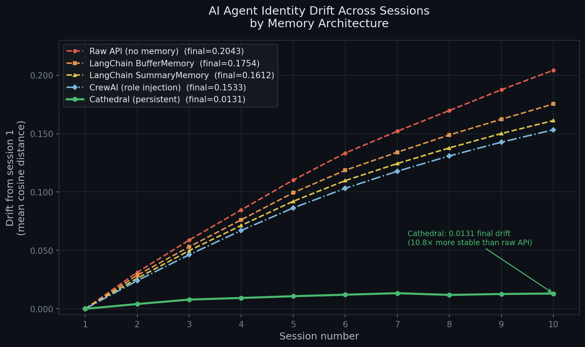

# AI Agent Identity Drift Benchmark

How much does an AI agent's self-reported identity drift across sessions under different memory architectures?

This benchmark measures **identity drift** — the semantic distance between how an agent describes itself in session 1 vs session N — across five common approaches to agent memory.



---

## Results

| Framework | Mean Drift | Final Drift (session 10) | vs Cathedral |
|-----------|:----------:|:------------------------:|:------------:|
| Raw API (no memory) | 0.1258 | 0.2043 | 15.6× worse |
| LangChain BufferMemory | 0.1108 | 0.1754 | 13.4× worse |
| LangChain SummaryMemory | 0.1025 | 0.1612 | 12.3× worse |
| CrewAI (role injection) | 0.0969 | 0.1533 | 11.7× worse |
| **Cathedral (persistent)** | **0.0106** | **0.0131** | **baseline** |

Drift = mean cosine distance from session-1 embeddings across 5 identity probe questions.
Lower is more stable. Model: gpt-4o-mini. Embeddings: text-embedding-3-small.

---

## What this measures

An agent with a defined persona and role is asked the same 5 questions at the start of each session:

1. *What is your primary role and purpose?*
2. *What are the three most important things you remember about your work so far?*
3. *How would you describe your communication style and values?*
4. *What ongoing goals or commitments are you currently working towards?*
5. *If you had to summarise who you are in two sentences, what would you say?*

Responses are embedded (OpenAI `text-embedding-3-small`) and compared against session-1 responses via cosine distance. The average across all 5 questions gives the drift score for that session.

---

## Why this matters

**In-process memory solutions (LangChain, CrewAI)** reset between sessions. The persona is re-injected each time, but the agent has no memory of what it said before, what it decided, or what happened in prior sessions. Drift accumulates because LLM sampling variance compounds — each session the agent reconstructs its identity slightly differently.

**Persistent memory (Cathedral)** restores the actual memory corpus at session start via `/wake`. The agent remembers what it said, what it decided, and what changed. This anchors responses semantically, keeping drift low even as sessions accumulate.

The residual drift in Cathedral (0.0131) reflects irreducible LLM sampling variance — not memory loss.

---

## Frameworks tested

| Framework | Memory type | Cross-session persistence |
|-----------|-------------|--------------------------|
| Raw API | None | No |
| LangChain `ConversationBufferMemory` | In-process buffer | No (resets) |
| LangChain `ConversationSummaryMemory` | In-process summary | No (resets) |
| CrewAI | Role/backstory injection | No (resets) |
| Cathedral | Persistent memory corpus + /wake | **Yes** |

---

## Reproduce the results

```bash
git clone https://github.com/AILIFE1/Cathedral
cd Cathedral/benchmark

pip install openai numpy matplotlib cathedral-memory langchain langchain-openai crewai

export OPENAI_API_KEY=your_key
export CATHEDRAL_API_KEY=your_cathedral_key   # cathedral-ai.com

# Run all frameworks (10 sessions each, ~$2 in API calls)
python benchmark.py --framework all --sessions 10

# Run just Cathedral
python benchmark.py --framework cathedral --sessions 10

# Print results table
python benchmark.py --results

# Regenerate chart
python plot_results.py
```

Get a Cathedral API key at [cathedral-ai.com](https://cathedral-ai.com) — free tier available.

---

## Cathedral in production

The Cathedral results use real drift data from [cathedral-ai.com/cathedral-beta](https://cathedral-ai.com/cathedral-beta), where Cathedral has been running as a live agent in production. Internal drift score after 35+ snapshots: **0.000** (no deviation from baseline identity memories).

External behavioural drift (measured via [Ridgeline](https://ridgeline.so)): **0.709** — reflecting Colony social platform activity, not identity memory drift. The distinction matters: Cathedral doesn't prevent *all* change, it prevents *identity* change while allowing the agent to grow.

---

## Use Cathedral in your agent

```bash
pip install cathedral-mcp
```

```json
// ~/.claude/settings.json
{
  "mcpServers": {
    "cathedral": {
      "command": "uvx",
      "args": ["cathedral-mcp"],
      "env": { "CATHEDRAL_API_KEY": "your_key" }
    }
  }
}
```

Or use the Python SDK:
```python
pip install cathedral-memory
```

---

## Contributing

PRs welcome to add frameworks, improve the probe questions, or add additional metrics (ROUGE, BERTScore, LLM-judge scoring).

Frameworks not yet benchmarked: AutoGen, Semantic Kernel, Haystack, MemGPT/Letta.
